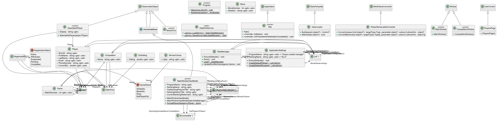
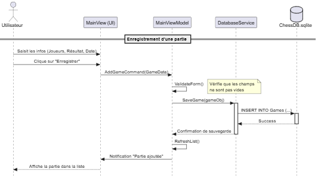
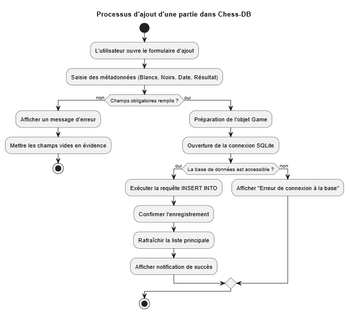

# Chess-DB

## Introduction 

Chess-DB est une application développée en C# utilisant le framework graphique Avalonia UI. L'objectif principal de ce logiciel est d'offrir une solution de gestion pour une fédération ou un club d'échecs utilisant un système "d'Elo", déjà largement répandu dans la communauté. L'application se concentre sur trois fonctionnalités principales :

1. Enregistrement des joueurs (informations personnelles, Elo, ...)
2. Gestion de tournois (création, inscriptions, planification des matchs, ...)
3. Suivi des parties (résultats et coups joués)

## Fonctionnalité supplémentaire de notre Projet

Nous avons développé un affichage interactif permettant à l'utilisateur de voir sur la page d'accueil les matchs à venir et un classement des meilleurs joueurs de la fédération. Notre objectif est d'offrir une vision claire aux membres et de mettre à disposition un outil le plus intuitif possible.

## Adaptabilité à d'autres fédérations 

Hormis l'encodage des parties, notre application est tout à fait adaptable pour d'autres fédérations, tant sportives que récréatives.

## Principes SOLID au sein de notre projet

Nous avons veillé à respecter les bonnes pratiques de développement, notamment :

### Single Responsibility Principle (SRP) :
 Nous avons séparé les responsabilités pour rendre le code plus maintenable. Par exemple, nos modèles (ex: `Player`) ne contiennent que les données, la logique d'affichage est gérée par le `MainWindowViewModel`, et la sauvegarde des fichiers est déléguée à un service dédié (`DataFileService`).
### Dependency Inversion Principle (DIP) :
 Pour réduire le couplage entre nos classes, nous utilisons l'injection de dépendances. Le `MainWindowViewModel` ne crée pas ses propres données en dur, mais reçoit le `DataManager` via son constructeur, ce qui rend l'application plus modulaire et testable.

## Diagramme de classes

## Diagramme de sequence

## Diagramme d'activité

